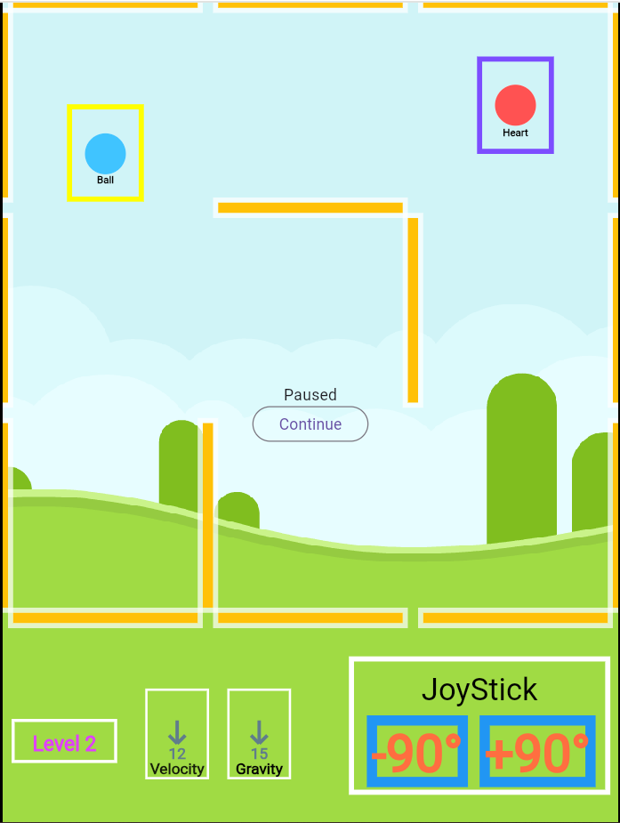

# Maze Ball
The snapshot of the game is shown in the picture below. The purpose of this game is about helping a ball reach a heart. Both heart and ball are balls trapped in a maze. The ball moves with a gravity which direction you can change.

You can rotate the direction of the gravity by +90 or -90 degrees. You can change them by pressing right or left arrow in your keyboard, or pressing the -90 and +90 buttons on the screen. It is good to know that the magnitude of the gravity does not change. Moreover, the velocity of the ball gets zeroed every time you change the direction. 

The game consists of 16 levels. As the level increases, the game gets more difficult in various ways. First, the size of the maze, the width and height by the scale of walls, increase, also resulting in the decrease of the radius of the ball. Second, the magnitude of gravity increases. Third, the number of walls inside the maze increase.

<!-- different menus -->
The game contains four different screens. The first screen you see is the welcome screen. It contains three different buttons, "Continue", "Start the game", and "Select Level". By clicking the "Continue" button, you resume from the last checkpoint. By clicking the "Start the game" button, you start the game from the beginning. And by clicking the "Select Level", you redirect to the "Level Selection" Screen.

The "Level Selection" screen includes 16 buttons each representing the level. Each level is colored with respect to its relative difficulty. The darker the color, the more difficult the level. By pressing one of these buttons, you can start the game from the desired level. Moreover, there is a back button at the end, in case you want to go back to the "Welcome" screen.

In addition, this screen is more responsive compared to other screens. The number of columns in the levels grid changes with respect to the width of the screen. Moreover, the grid has a max width of 600px.

The "Game Over" screen is showed whenever you lost the game at a level. The screen shows at what level you have lost. Moreover, you can go back to the "Welcome" menu by pressing the "Return" button at the end of the screen.

The "Won" screen is showed when you have won the game, passed the last level. There is a congratulations message and a return button redirecting you back to the welcome screen. It is worth noting your saved progress has lost when you have won the game.

If you lost in the middle levels, do not worry. Your progress saves. You can continue from the level you lost from the "Welcome" menu, clicking the "Continue" button. However, your progress gets lost if you pass the last level and win the game.

As mentioned in the previous paragraphs, you can play the game with a keyboard or mouse, but are urged to do it. You can play the game with the touch screen of your mobile phone by working with the "joystick" section on the bottom right of the game, pressing the "+90" and "-90" buttons.

Moreover, there are game helpers inside the game. At the bottom left of the game screen there are three helpers. The first one shows the level of the game. The second one shows the velocity of the ball you are directing, both in terms of direction and magnitude. Third, there is a helper for the direction and magnitude of the gravity that controls the ball.

Finally, you can check the game online in this [address](https://maze-ball-game.web.app).